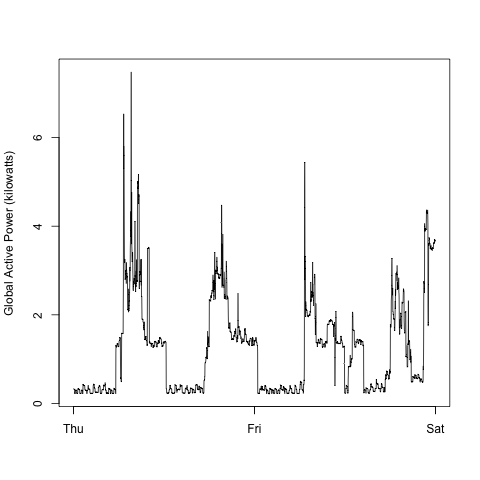

# Plotting

## Recreating Plots

To recreate a plot:

- Source `getData.R` and execute `getData` to download and unzip the source data.
- Source one of the `plot[1-4].R` files. They use `loadData.R` to read and convert the data.

## Created Plots:

Original first, then the recreation.

### Plot1

 

### Plot2

 

### Plot3

 

### Plot4

 